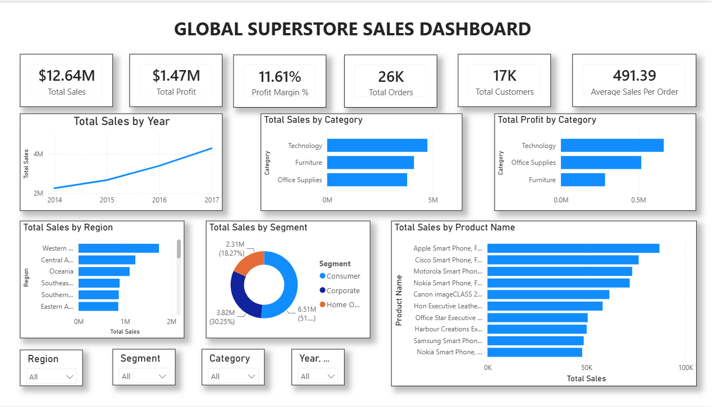

# 📊 Global Superstore Sales Dashboard

An interactive **Power BI dashboard** built using the **Global Superstore Dataset** to analyze sales performance, profitability, customer segments, regional performance, and top-selling products.

---

# 📸 Dashboard Preview



---

# 🎯 Business Problem

Retail businesses generate thousands of sales transactions every day. Decision-makers need a single dashboard that provides quick insights into sales performance, profitability, customer behavior, and regional trends.

This dashboard was built to help business users monitor key performance indicators and make data-driven decisions using interactive visualizations.

---

# 🛠️ Tools & Technologies

- Microsoft Power BI Desktop
- Power Query
- DAX (Data Analysis Expressions)
- Data Modeling
- Star Schema
- Interactive Dashboards

---

# 📂 Dataset

**Dataset Name**

Global Superstore Dataset

**Dataset Source**

[Global Superstore Data - Kaggle](https://www.kaggle.com/datasets/rohitgrewal/global-superstore-data)

Tables Used

- Orders
- People
- Returns

---

# ⭐ Data Model

The dashboard follows a **Star Schema**.

### Fact Table

- Orders

### Dimension Tables

- People
- Returns

Relationships were created between the tables to enable efficient filtering and reporting.

---

# 📈 Key Performance Indicators (KPIs)

- 💰 Total Sales
- 💵 Total Profit
- 📊 Profit Margin
- 📦 Total Orders
- 👥 Total Customers
- 🛒 Average Sales Per Order

---

# 📊 Dashboard Features

- KPI Cards
- Sales Trend Analysis
- Sales by Category
- Profit by Category
- Sales by Region
- Sales by Segment
- Top 10 Products by Sales
- Interactive Slicers
  - Region
  - Segment
  - Category
  - Year

---

# 💡 Business Insights

- Technology generated the highest sales and profit.
- Consumer was the largest customer segment.
- Furniture generated comparatively lower profit despite good sales, indicating the need for further investigation.
- Interactive slicers allow dynamic analysis across Region, Category, Segment, and Year.

---

# 📁 Repository Files

```
Global-Superstore-Sales-Dashboard
│
├── Global_superstore_sales_dashboard.pbix
├── README.md
└── global_sales_dashboard.png
```

---

# 📚 Skills Demonstrated

- Data Cleaning
- Data Transformation
- Data Modeling
- Star Schema
- Relationship Management
- DAX
- Power Query
- Dashboard Design
- Business Intelligence
- Data Visualization
- Business Analysis

---

# 🚀 Future Improvements

- Profit Margin by Region
- Discount vs Profit Analysis
- Customer Retention Analysis
- Monthly Profit Trends
- Drill-through Pages
- Dynamic Titles
- Row-Level Security (RLS)

---

# 👤 Author

**Aksaya**

Aspiring Data Analyst

---

## ⭐ If you found this project helpful, consider giving it a Star!
